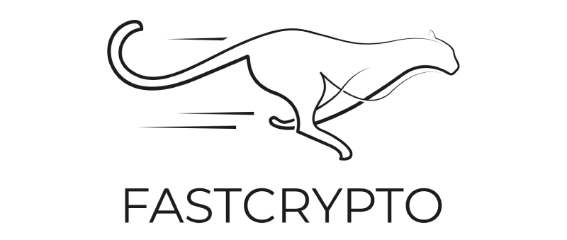

# fastcrypto

[![crate][crate-image]][crate-link]
[![Docs][docs-image]][docs-link]
[](https://github.com/MystenLabs/fastcrypto/actions)
[](https://github.com/MystenLabs/sui/actions/workflows/fastcrypto_pull.yml)
![Apache2/MIT licensed][license-image]
![Rust Version][rustc-image]
[](https://codecov.io/gh/MystenLabs/fastcrypto)

<p align="center">
 
</p>

`fastcrypto` is a common cryptography library used in software at Mysten Labs. It contains three individual crates: `fastcrypto`, `fastcrypto-zkp` and `fastcrypto-cli`. They are published as independent crates to encourage reusability across different applications and domains.

`fastcrypto` is a wrapper library around several carefully selected crates with the following considerations:

- Security: Whether the libraries are vulnerable to known attack vectors or possible misuses.
- Performance: Whether the crate performs cryptographic operations with speed after extensive benchmarking. This is critical for the Sui Network to be performant when signing and verifying large amounts of transactions and certificates.
- Determinism: Whether the signature is non-malleable.
- Popularity: Whether the library is used by other consensus critical systems.

Furthermore, we extend the selected libraries with additional features:
- Robust testing framework: [Wycheproof tests](https://github.com/google/wycheproof) and [prop tests](https://altsysrq.github.io/proptest-book/intro.html) are added when possible to protect against arbitrary inputs and crafted edge cases.
- Zeroization: Sensitive private key materials are cleared from memory when it goes out of scope using the [zeroize](https://docs.rs/zeroize/latest/zeroize/) trait. Note that this is *best effort* and does not guarantee that all sensitive data is cleared from memory as data may be copied or moved around by the compiler, FFI, etc. 
- Serialization: Effective and standardized serialization are required.

This library will be continuously updated with more schemes and faster implementations based on benchmarking results, RFC updates, new research and auditor inputs.

The `fastcrypto` crate contains:

- Traits that should be implemented by concrete types representing digital cryptographic materials.
    -  [`SigningKey`]: Trait implemented by the private key with associated types of its public key and signature.
    - [`VerifyingKey`]: Trait implemented by the public key with associated types of its private key and signature. It also includes a default implementation of batch verification that fails on empty batch verification.
    - [`Authenticator`]: Trait implemented by the signature with associated types of its public key and private key.
    - [`AggregateAuthenticator`]: Trait implemented by the aggregated signature, which allows adding signatures to the aggregated signature and verifying against the public keys with the corresponding messages.
    - [`KeyPair`]: Trait that represents a public/private keypair, which includes the common get priv/pub key functions and a keypair generation function with seeded randomness.
    - [`ToFromBytes`]: Trait that aims to minimize the number of steps involved in obtaining a serializable key.
    - [`EncodeDecodeBase64`]: Trait that extends `ToFromBytes` for immediate conversion to/from Base64 strings. This is the format in which cryptographic materials are stored.

- Concrete signature schemes of type that implement the recommended traits required for cryptographic agility.
    - Ed25519: Backed by [`ed25519-consensus`](https://github.com/penumbra-zone/ed25519-consensus) crate. Compliant to [ZIP-215](https://zips.z.cash/zip-0215) that defines the signature validity that is lacking from RFC8032 but critical for consensus algorithms. [`ed25519-dalek`](https://github.com/dalek-cryptography/ed25519-dalek) is fully deprecated due to the recently discovered [Chalkias double pub-key api vulnerability](https://github.com/MystenLabs/ed25519-unsafe-libs).
    - Secp256k1: ECDSA signatures over the secp256k1 curve. Backed by [Secp256k1 FFI](https://crates.io/crates/secp256k1/0.23.1) wrapper that binds to C library and provides performance faster than the native Rust implementation [k256](https://crates.io/crates/k256) library by ~30% on verification. Produces either a standard ECDSA signature or a 65-byte recoverable signature of shape [r, s, v] where v can be 0 or 1 representing the recovery Id. Produces deterministic signatures using the pseudo-random deterministic nonce generation according to [RFC6979](https://www.rfc-editor.org/rfc/rfc6979), without the strong requirement to generate randomness for nonce protection. Uses sha256 as the default hash function for sign and verify. An interface for `verify_hashed` is provided to accept a pre-hashed message and its signature for verification. Supports public key recovery by providing the Secp256k1 recoverable signature with the corresponding pre-hashed message. An accepted signature must have its `s` in the lower half of the curve order. If s is too high, normalize `s` to `order - s` where curve order is `0xFFFFFFFFFFFFFFFFFFFFFFFFFFFFFFFEBAAEDCE6AF48A03BBFD25E8CD0364141`. See more at [BIP-0062](https://github.com/bitcoin/bips/blob/master/bip-0062.mediawiki#low-s-values-in-signatures).
    - Secp256r1: ECDSA signatures over the secp256r1 curve backed by the [`p256`](https://crates.io/crates/p256) crate which is a pure rust implementation of the Secp256r1 (aka [NIST P-256](https://nvlpubs.nist.gov/nistpubs/FIPS/NIST.FIPS.186-4.pdf) and prime256v1) curve. The functionality from `p256` is extended such that, besides standard ECDSA signatures, our implementation can also produce and verify 65 byte recoverable signatures of the form [r, s, v] where v is the recoveryID. Signatures are produced deterministically using the pseudo-random deterministic nonce generation according to [RFC6979](https://www.rfc-editor.org/rfc/rfc6979), without the strong requirement to generate randomness for nonce protection. Uses sha256 as the default hash function for sign and verify. Supports public key recovery by providing the Secp256r1 ECDSA recoverable signature with the corresponding pre-hashed message. An accepted signature must have its `s` in the lower half of the curve order. If s is too high, normalize `s` to `order - s` where curve order is `0xFFFFFFFF00000000FFFFFFFFFFFFFFFFBCE6FAADA7179E84F3B9CAC2FC632551` defined [here](https://secg.org/SEC2-Ver-1.0.pdf).
    - BLS12-381: Backed by [`blst`](https://github.com/supranational/blst) crate written in Assembly and C that optimizes for performance and security. G1 and G2 points are serialized following [ZCash specification](https://github.com/supranational/blst#serialization-format) in compressed format. Provides functions for verifying signatures in the G1 group against public keys in the G2 group (min-sig) or vice versa (min-pk). Provides functions for aggregating signatures and fast verifying aggregated signatures, where public keys are assumed to be verified for proof of possession.
   - RSA: Backed by crate [rsa](https://crates.io/crates/rsa).  Provides functions to sign and verify RSA signature according to [RFC 8017](https://www.rfc-editor.org/rfc/rfc8017)

- Utility functions on cryptographic primitives. Some of them serve as the Rust implementation of the Move smart contract API in Sui.
    - HKDF: An HMAC-based key derivation function based on [RFC-5869](https://tools.ietf.org/html/rfc5869), to derive keypairs with a salt and an optional domain for the given keypair. This requires choosing an HMAC function that expands precisely to the byte length of a private key for the chosen KeyPair parameter.
    - Pedersen Commitment: Function to create a Pedersen commitment with a value and a blinding factor. Add or subtract Ristretto points that represent Pedersen commitments.
    - Bulletproofs Range Proof: Function to prove that a committed value is an unsigned integer that is within the range `[0, 2^bits)`. Function to verify that the commitment is a Pedersen commitment of some value with an unsigned bit length, a value is an integer within the range `[0, 2^bits)`.
    - Elliptic Curve VRF (ECVRF): A verifiable random function implementation using the Ristretto255 group. Function to create a proof based on a given input and verify a proof for a given output, based on specification in [draft-irtf-cfrg-vrf-15](https://datatracker.ietf.org/doc/draft-irtf-cfrg-vrf/).

- Encoding: Base64 and Hex are defined with an encoding trait with its customized serialization and validations, backed by [base64ct](https://crates.io/crates/base64ct) and [hex]((https://crates.io/crates/base64ct)). Notably, the base64ct crate has been chosen instead of the most popular base64 Rust crate, because (a) it is constant time and (b) mangled encodings are explicitly rejected to prevent malleability attacks when decoding, see [paper](https://dl.acm.org/doi/10.1145/3488932.3527284) on in-depth analysis.

- Hash functions wrappers: [SHA2_256](https://en.wikipedia.org/wiki/SHA-2) with 256 bit digests, [SHA3_256](https://en.wikipedia.org/wiki/SHA-3) with 256 bit digests, [SHA2_512](https://en.wikipedia.org/wiki/SHA-2) with 512 bit digests, [SHA3_512](https://en.wikipedia.org/wiki/SHA-3) with 512 bit digests, [KECCAK](https://keccak.team/files/Keccak-reference-3.0.pdf) with 256 bit digests, [BLAKE2-256](https://en.wikipedia.org/wiki/BLAKE_(hash_function)#BLAKE2) with 256 bit digests.

- Multiset Hash: A hash function where the output of the hash function is a point on the elliptic curve. It also allows for efficient computation for the hash of the union of two multiset. 

- A asynchronous signature service is provided for testing and benchmarking.

The `fastcryto-zkp` crate contains APIs to verify a Groth16 proof along with its prepared verifying key and public inputs. BN254 and BLS12381 curves are supported. The verifier is backed [Arkworks](https://github.com/arkworks-rs/) and [`blst`](https://github.com/supranational/blst) libraries.

The `fastcrypto-cli` crate includes CLI tools available for debugging. See usages with `-h` flag.

```
$ cargo build --bin encode-cli
$ target/debug/encode-cli -h
$ cargo build --bin sigs-cli
$ target/debug/sigs-cli -h
$ cargo build --bin ecvrf-cli
$ target/debug/ecvrf-cli -h
```

## WASM

The `fastcrypto` crate can be used when building WASM modules. To do this, enable the `wasm` feature flag when including the `fastcrypto` crate in your `Cargo.toml` file and follow the instructions found in the [Rust and WASM book](https://rustwasm.github.io/docs/book/) to build the WASM module.

## Tests

There exist unit tests for all primitives in all three crates, which can be run by: 
```
$ cargo test
```

## Benchmarks

In `fastcrypto`, one can compare all currently implemented signature schemes for *sign, verify, verify_batch* and *key-generation* by running:

```
$ cargo bench
```

A [report of the benchmarks](https://mystenlabs.github.io/fastcrypto/benchmarks/criterion/reports/) is generated for each release, allowing easy comparison of the performance of the different cryptographic primitives and schemes available in `fastcrypto`. As an example, we get these timings for signing messages and verifying the signature for the different schemes in `fastcrypto` as of revision [dd5adb](https://github.com/MystenLabs/fastcrypto/commit/dd5adb669b895785d3f34abc562fca26c943154a):


Below is another plot made using data from the benchmark report, showing benchmarks for batched signature verification where all signatures are on the same message:


In `fastcrypto-zkp`, benchmarks can be ran for Arkworks to `blst` representation of field elements, and verifying Groth16 in BN254 and BLS12381:

```
$ cd fastcrypto-zkp/
$ cargo bench
```
## License

All crates licensed under either of

* [Apache License, Version 2.0](http://www.apache.org/licenses/LICENSE-2.0)
* [MIT license](http://opensource.org/licenses/MIT)

[//]: # (badges)

[crate-image]: https://buildstats.info/crate/fastcrypto
[crate-link]: https://crates.io/crates/fastcrypto
[docs-image]: https://docs.rs/fastcrypto/badge.svg
[docs-link]: https://docs.rs/fastcrypto/
[license-image]: https://img.shields.io/badge/license-Apache2.0/MIT-blue.svg
[rustc-image]: https://img.shields.io/badge/rustc-1.63+-blue.svg
