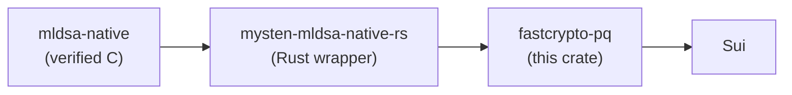

# fastcrypto-pq

Post-quantum signature schemes behind fastcrypto's traits: ML-DSA-65 (FIPS 204), the
scheme Sui is integrating for quantum-safe accounts, and the SLH-DSA (FIPS 205)
building blocks for hash-based signatures.

> [!WARNING]
> This crate has not been audited and is not ready for production use.

## How it fits together



The wrapper is a separate crate because it needs a C toolchain and does not build for
wasm32; consumers who only want fastcrypto's classical schemes pay neither cost. On
the ML-DSA side this crate adds no cryptography of its own, only the trait
implementations, serialization, and the key-management contract the rest of Sui
relies on. The SLH-DSA side is implemented here directly, in pure Rust.

## The trait layer's contract

- `MLDSA65KeyPair`, `MLDSA65PrivateKey`, `MLDSA65PublicKey`, and `MLDSA65Signature`
  implement the same fastcrypto traits as the classical schemes (`KeyPair`, `Signer`,
  `VerifyingKey`, `ToFromBytes`), so call sites treat ML-DSA-65 like Ed25519 with
  larger byte arrays.
- The private key's serialized form is the 32-byte FIPS 204 seed, so wallets store and
  back up exactly what they do today. Deserializing a key pair re-derives the public
  key from the seed; a mismatched pair cannot be constructed.
- Signing is hedged, the FIPS 204 default: fresh OS randomness for every signature.
  The FIPS 204 context string is frozen to the empty string.
- Serialization is the raw encoding: bincode, BCS, and `as_ref()` produce identical
  bytes, and the human-readable serde form is base64.
- Sizes: public key 1,952 B, signature 3,309 B, private key 32 B.

## SLH-DSA (FIPS 205)

`src/sphincs/` is a hand-written Rust implementation of the SLH-DSA building blocks:
WOTS+ one-time signatures, FORS, XMSS, and the hypertree. The top-level FIPS 205
sign/verify API is in progress on the `feat/slh-dsa-toplevel` branch and lands here
next.

At the parameter set Sui plans for vaults, SLH-DSA-SHA2-128s: public key 32 B,
signature 7,856 B. The full FIPS 205 and draft SP 800-230 parameter tables are in
[src/sphincs/README.md](src/sphincs/README.md).

Measured through this implementation on an Apple M2 Max (pure Rust; treat timings as
an upper bound): key generation 105.5 ms, sign 805 ms, verify 761 µs. Slow signing
and a signature that caching cannot shrink are why this scheme targets Move
smart-contract vaults rather than the native transaction path.

## Testing

```bash
# everything, both schemes
cargo test -p fastcrypto-pq --all-features

# only the SLH-DSA building blocks
cargo test -p fastcrypto-pq sphincs
```

Beyond trait mechanics, CI pins the wire format itself: interop vectors produced by
`@noble/post-quantum`, an independent TypeScript implementation of FIPS 204, must
reproduce byte for byte through this crate and the wrapper, and its signatures must
verify here. The ML-DSA known-answer tests live in the wrapper repository; the
sphincs module's tests live inline with the module.

## Benchmarks

```bash
# ML-DSA-65: sign, verify, key generation, serde
cargo bench -p fastcrypto-pq --features native --bench mldsa65

# WOTS+ one-time signatures across parameter sets
cargo bench -p fastcrypto-pq --bench winternitz_ots
```

Measured through this crate on an Apple M2 Max, medians:

|                | Ed25519 | ML-DSA-65 (`native`) | ML-DSA-65 (portable C) |
| -------------- | ------- | -------------------- | ---------------------- |
| Sign           | 13 µs   | 66 µs                | 189 µs                 |
| Verify         | 28 µs   | 24 µs                | 57 µs                  |
| Key generation | 11 µs   | 27 µs                | 73 µs                  |

Verification, the cost validators pay per transaction, is at parity with Ed25519. The
`native` feature forwards to the wrapper's formally verified NEON (aarch64) and AVX2
(x86_64) backends behind a runtime CPU probe; outputs are byte-identical across
backends, which the tests check.
